# Arquitetura do Sistema de Votação Eletrônica - Vota Aí

## Diagrama de Arquitetura Geral do Sistema

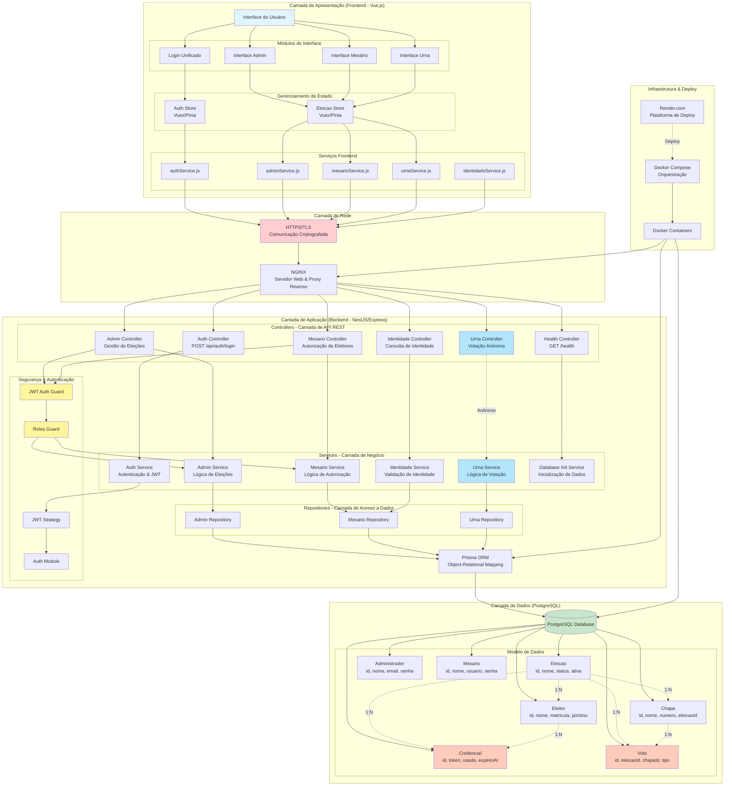

---

## Diagrama de Fluxo de Autenticação

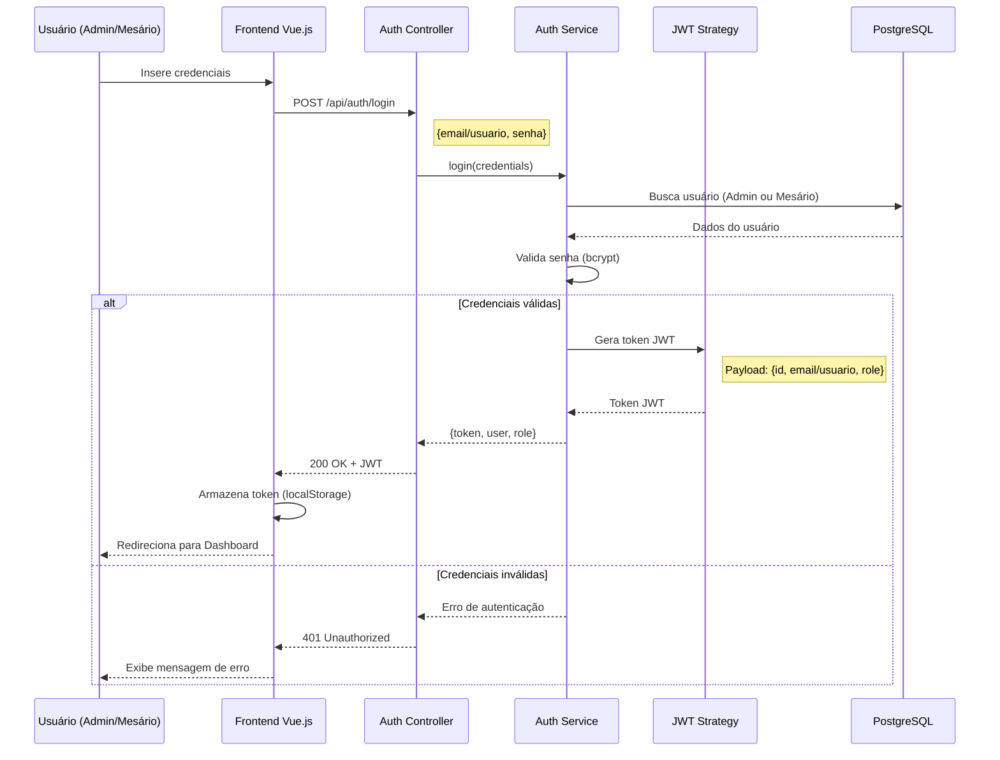

---

## Diagrama de Fluxo de Autorização de Eleitor (Mesário)

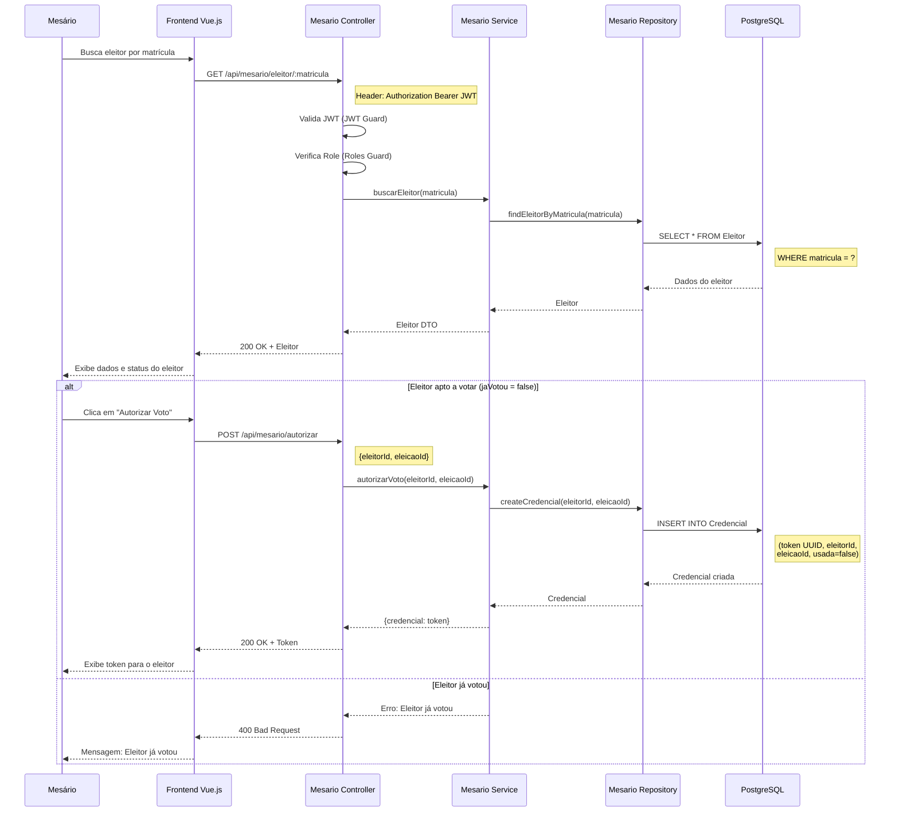

---

## Diagrama de Fluxo de Votação (Urna Eletrônica)

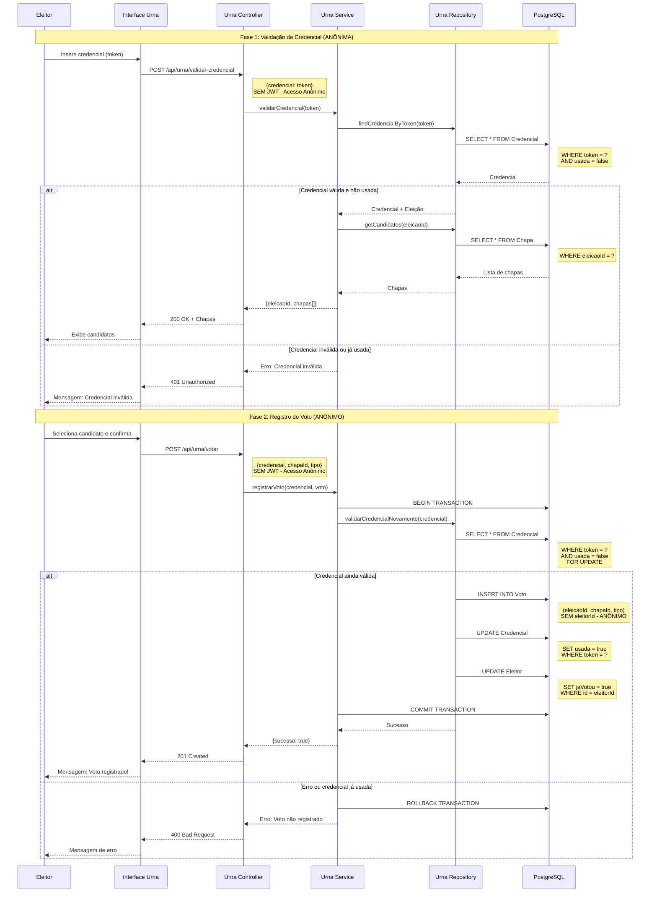

---

## Diagrama de Fluxo de Gestão de Eleições (Admin)

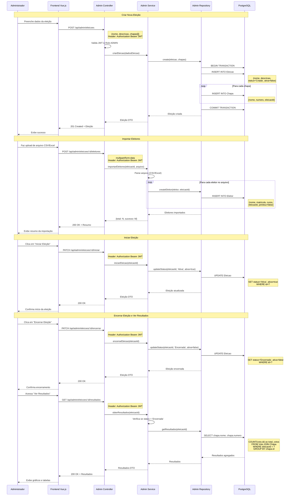

---

## Diagrama de Componentes e Módulos

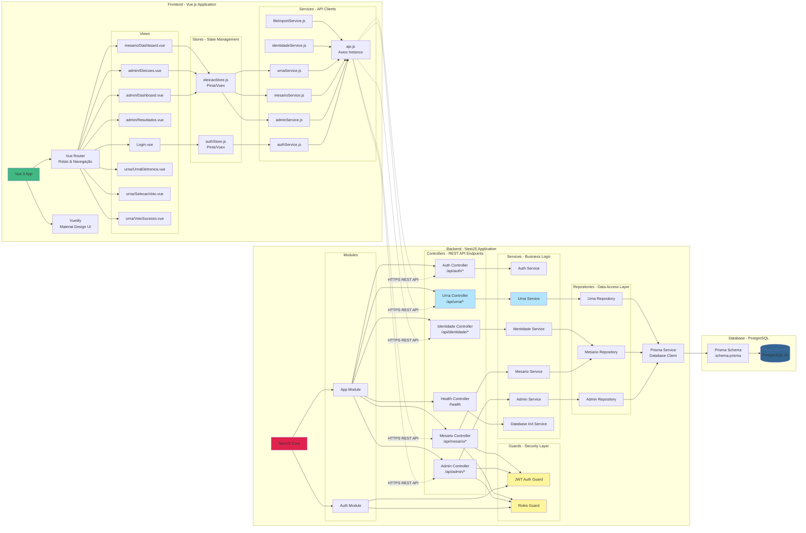

---

## Diagrama de Deployment (Infraestrutura)

```mermaid
graph TB
    subgraph "Usuários"
        USER_ADMIN[👤 Administrador]
        USER_MESARIO[👤 Mesário]
        USER_ELEITOR[👤 Eleitor]
    end
    
    subgraph "Internet / HTTPS"
        INTERNET{Internet<br/>HTTPS/TLS}
    end
    
    subgraph "Render.com - Platform as a Service"
        subgraph "Web Service - Frontend"
            RENDER_FRONT[Render Web Service<br/>Frontend Vue.js]
            NGINX_FRONT[NGINX<br/>Serve Static Files]
            STATIC_FILES[Static Assets<br/>HTML, CSS, JS]
        end
        
        subgraph "Web Service - Backend"
            RENDER_BACK[Render Web Service<br/>Backend NestJS]
            NODE_RUNTIME[Node.js Runtime]
            BACKEND_APP[NestJS Application]
        end
        
        subgraph "Database Service"
            RENDER_DB[Render PostgreSQL<br/>Managed Database]
            POSTGRES_DB[(PostgreSQL 15<br/>Persistent Storage)]
        end
    end
    
    subgraph "Desenvolvimento Local (Opcional)"
        subgraph "Docker Compose Orchestration"
            DC[Docker Compose<br/>docker-compose.yml]
            
            subgraph "Container: Frontend"
                DC_NGINX[NGINX Container<br/>Port 80]
                DC_VUE[Vue.js Build<br/>Static Files]
            end
            
            subgraph "Container: Backend"
                DC_BACKEND[NestJS Container<br/>Port 3000]
                DC_NODE[Node.js 18+]
            end
            
            subgraph "Container: Database"
                DC_POSTGRES[PostgreSQL Container<br/>Port 5432]
                DC_VOLUME[(Volume<br/>postgres_data)]
            end
        end
    end
    
    subgraph "Controle de Versão"
        GITHUB[GitHub Repository<br/>github.com/JuanGomes404/Vota-Ai-Urna]
    end
    
    subgraph "CI/CD Pipeline"
        RENDER_DEPLOY[Render Auto-Deploy<br/>Continuous Deployment]
    end
    
    %% Fluxo de Usuários
    USER_ADMIN --> INTERNET
    USER_MESARIO --> INTERNET
    USER_ELEITOR --> INTERNET
    
    INTERNET --> RENDER_FRONT
    INTERNET --> RENDER_BACK
    
    %% Render Frontend
    RENDER_FRONT --> NGINX_FRONT
    NGINX_FRONT --> STATIC_FILES
    
    %% Render Backend
    RENDER_BACK --> NODE_RUNTIME
    NODE_RUNTIME --> BACKEND_APP
    
    %% Comunicação Backend -> Database
    BACKEND_APP -->|DATABASE_URL<br/>PostgreSQL Connection| RENDER_DB
    RENDER_DB --> POSTGRES_DB
    
    %% Docker Compose (Desenvolvimento)
    DC --> DC_NGINX
    DC --> DC_BACKEND
    DC --> DC_POSTGRES
    
    DC_NGINX --> DC_VUE
    DC_BACKEND --> DC_NODE
    DC_POSTGRES --> DC_VOLUME
    
    DC_BACKEND -->|DATABASE_URL| DC_POSTGRES
    
    %% CI/CD
    GITHUB -->|Git Push| RENDER_DEPLOY
    RENDER_DEPLOY -->|Auto Build & Deploy| RENDER_FRONT
    RENDER_DEPLOY -->|Auto Build & Deploy| RENDER_BACK
    
    %% Variáveis de Ambiente
    RENDER_BACK -.->|Environment Variables<br/>DATABASE_URL, JWT_SECRET| BACKEND_APP
    
    style USER_ADMIN fill:#90caf9
    style USER_MESARIO fill:#90caf9
    style USER_ELEITOR fill:#90caf9
    style RENDER_FRONT fill:#81c784
    style RENDER_BACK fill:#81c784
    style RENDER_DB fill:#81c784
    style POSTGRES_DB fill:#64b5f6
    style GITHUB fill:#333333
    style RENDER_DEPLOY fill:#ffb74d
```

---

## Diagrama de Modelo de Dados (Entity-Relationship)

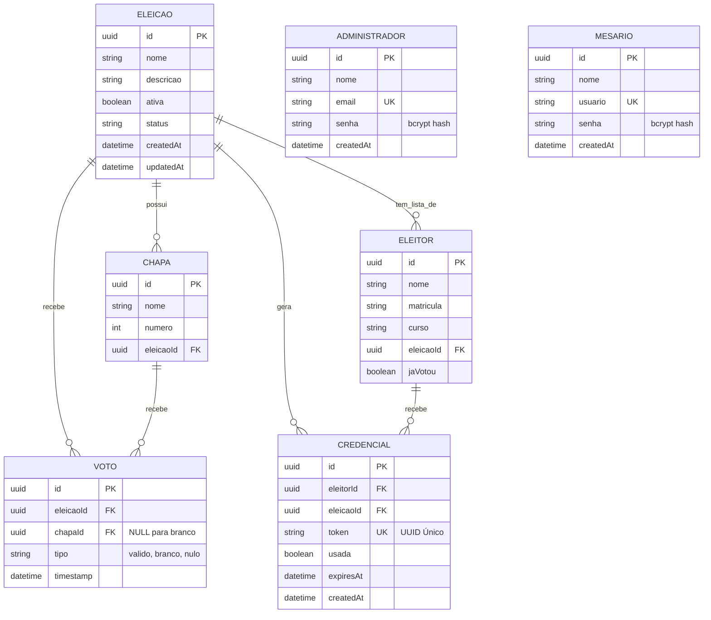

---

## Diagramas de Processo em Notação BPMN 2.0

> **Nota:** Os diagramas abaixo seguem a notação BPMN 2.0 (Business Process Model and Notation) conforme especificação da OMG (Object Management Group). Para visualização gráfica completa, utilize ferramentas como Bizagi Modeler, Camunda Modeler, Draw.io, ou Lucidchart.

---

### Diagrama BPMN 1 - Preparação da Votação (Administrador)

**Pool:** Sistema de Votação Eletrônica  
**Lane:** Administrador  
**Tipo de Processo:** Processo de Negócio Principal

#### Elementos do Processo:

**EVENTOS:**
```
[E1] Start Event (None)
     Nome: "Admin Acessa Sistema"
     Tipo: Start Event (círculo simples)
     Trigger: None

[E2] End Event (None)
     Nome: "Eleição Ativa e Pronta"
     Tipo: End Event (círculo com borda grossa)

[E3] Intermediate Error Event
     Nome: "Erro de Autenticação"
     Tipo: Intermediate Boundary Event (círculo com raio)
```

**ATIVIDADES (TASKS):**
```
[T1] User Task: "Realizar Login"
     Responsável: Administrador
     Input: Credenciais (email, senha)
     Output: Token JWT

[T2] User Task: "Acessar Dashboard"
     Responsável: Administrador

[T3] User Task: "Criar Nova Eleição"
     Responsável: Administrador
     
[T4] User Task: "Preencher Formulário de Eleição"
     Responsável: Administrador
     Input: Nome, Descrição, Lista de Chapas
     
[T5] Service Task: "Validar Dados do Formulário"
     Implementação: Backend Service
     
[T6] Service Task: "Salvar Eleição no Banco de Dados"
     Implementação: Admin Repository
     Output: Eleição com status "Criada"
     
[T7] User Task: "Importar Lista de Eleitores"
     Responsável: Administrador
     
[T8] User Task: "Upload de Arquivo CSV/Excel"
     Responsável: Administrador
     Input: Arquivo (CSV/Excel)
     
[T9] Service Task: "Validar Arquivo"
     Implementação: File Import Service
     Validações: Formato, Estrutura, Dados
     
[T10] Service Task: "Processar Arquivo"
      Implementação: Admin Service
      Processo: Parse linha por linha, validar matrícula única
      
[T11] Service Task: "Salvar Eleitores no Banco"
      Implementação: Admin Repository
      Operação: Bulk Insert na tabela Eleitor
      
[T12] User Task: "Exibir Resumo de Importação"
      Output: Total de eleitores importados
      
[T13] User Task: "Revisar Dados da Eleição"
      Responsável: Administrador
      Review: Chapas, Eleitores, Configurações
      
[T14] User Task: "Iniciar Eleição"
      Responsável: Administrador
      
[T15] Service Task: "Atualizar Status da Eleição"
      Implementação: Admin Service
      Operação: UPDATE Eleicao SET status='Ativa', ativa=true
      
[T16] Service Task: "Notificar Mesários"
      Implementação: Notification Service
      Método: Email/Sistema
```

**GATEWAYS:**
```
[G1] Exclusive Gateway (XOR): "Autenticação Válida?"
     Tipo: Data-Based Exclusive Gateway (losango vazio)
     Condições:
       - [Sim] Credenciais corretas → T2
       - [Não] Credenciais incorretas → E3 → T1

[G2] Exclusive Gateway (XOR): "Dados do Formulário Válidos?"
     Condições:
       - [Sim] Validação passou → T6
       - [Não] Erros encontrados → Mostrar erros → T4

[G3] Exclusive Gateway (XOR): "Arquivo Válido?"
     Condições:
       - [Sim] Formato e dados corretos → T10
       - [Não] Erros no arquivo → Mostrar erros → T7

[G4] Exclusive Gateway (XOR): "Confirma Início da Eleição?"
     Condições:
       - [Sim] Administrador confirma → T14
       - [Não] Administrador cancela → T2
```

**FLUXO DE SEQUÊNCIA:**
```
E1 → T1 → G1
G1 → [Não] → E3 → T1
G1 → [Sim] → T2 → T3 → T4 → T5 → G2
G2 → [Não] → T4
G2 → [Sim] → T6 → T7 → T8 → T9 → G3
G3 → [Não] → T7
G3 → [Sim] → T10 → T11 → T12 → T13 → G4
G4 → [Não] → T2
G4 → [Sim] → T14 → T15 → T16 → E2
```

**DATA OBJECTS:**
```
[D1] Data Object: "Credenciais do Administrador"
     Estado: Input
     Usado em: T1

[D2] Data Object: "Token JWT"
     Estado: Output de T1, Input de T2-T16

[D3] Data Object: "Dados da Eleição"
     Estado: Input/Output
     Usado em: T4, T5, T6

[D4] Data Object: "Arquivo de Eleitores"
     Estado: Input
     Usado em: T8, T9, T10

[D5] Data Store: "Banco de Dados PostgreSQL"
     Operações: Read/Write
     Usado em: T6, T11, T15
```

---

### Diagrama BPMN 2 - Registro de Voto (Colaboração com 3 Pools)

**Tipo:** Diagrama de Colaboração (Collaboration Diagram)

#### Pool 1: Mesário

**EVENTOS:**
```
[E1.1] Start Event: "Eleitor Apresenta Documento"
[E1.2] End Event (Error): "Acesso Negado"
```

**ATIVIDADES:**
```
[T1.1] User Task: "Realizar Login no Sistema"
       Responsável: Mesário
       
[T1.2] User Task: "Buscar Eleitor por Matrícula"
       Responsável: Mesário
       Input: Matrícula do eleitor
       
[T1.3] Service Task: "Consultar Eleitor no Banco"
       Implementação: Mesario Service
       
[T1.4] User Task: "Autorizar Voto"
       Responsável: Mesário
       
[T1.5] Service Task: "Gerar Credencial UUID"
       Implementação: Mesario Service
       Output: Token UUID único
       
[T1.6] User Task: "Exibir Credencial na Tela"
       Output: Token visível para o mesário
       
[T1.7] User Task: "Informar Credencial ao Eleitor"
       Responsável: Mesário
       Método: Verbal
```

**GATEWAYS:**
```
[G1.1] Exclusive Gateway: "Eleitor Encontrado?"
       Condições:
         - [Sim] Eleitor cadastrado → G1.2
         - [Não] Não cadastrado → E1.2

[G1.2] Exclusive Gateway: "Eleitor Já Votou?"
       Condições:
         - [Sim] jaVotou = true → E1.2
         - [Não] jaVotou = false → T1.4
```

**FLUXO:**
```
E1.1 → T1.1 → T1.2 → T1.3 → G1.1
G1.1 → [Não] → E1.2
G1.1 → [Sim] → G1.2
G1.2 → [Sim] → E1.2
G1.2 → [Não] → T1.4 → T1.5 → T1.6 → T1.7 → [Message Flow para Pool 2]
```

---

#### Pool 2: Eleitor na Urna Eletrônica

**EVENTOS:**
```
[E2.1] Message Start Event: "Recebe Credencial"
       Trigger: Message Flow de Pool 1
       
[E2.2] End Event (Error): "Voto Não Registrado"
[E2.3] End Event (Success): "Aguarda Registro"
```

**ATIVIDADES:**
```
[T2.1] User Task: "Ir até a Urna Eletrônica"
       Responsável: Eleitor
       
[T2.2] User Task: "Inserir Credencial"
       Responsável: Eleitor
       Input: Token UUID
       
[T2.3] Service Task: "Validar Credencial"
       Implementação: Urna Service
       Validação: Token existe, não foi usada
       
[T2.4] Service Task: "Carregar Candidatos da Eleição"
       Implementação: Urna Repository
       
[T2.5] User Task: "Exibir Lista de Candidatos"
       Output: Chapas disponíveis
       
[T2.6] User Task: "Analisar Opções"
       Responsável: Eleitor
       
[T2.7] User Task: "Selecionar Chapa"
       Responsável: Eleitor
       
[T2.8] User Task: "Votar em Branco"
       Responsável: Eleitor
       
[T2.9] User Task: "Digitar Número Inválido (Voto Nulo)"
       Responsável: Eleitor
       
[T2.10] User Task: "Exibir Tela de Confirmação"
        Output: Resumo do voto escolhido
        
[T2.11] User Task: "Confirmar Voto"
        Responsável: Eleitor
```

**GATEWAYS:**
```
[G2.1] Exclusive Gateway: "Credencial Válida?"
       Condições:
         - [Sim] Token válido e não usado → T2.4
         - [Não] Token inválido/usado → G2.2

[G2.2] Exclusive Gateway: "Tentar Novamente?"
       Condições:
         - [Sim] → T2.2
         - [Não] → E2.2

[G2.3] Inclusive Gateway: "Tipo de Voto?"
       Condições paralelas:
         - [Candidato] → T2.7
         - [Branco] → T2.8
         - [Nulo] → T2.9

[G2.4] Exclusive Gateway: "Eleitor Confirma?"
       Condições:
         - [Sim] Confirma → E2.3 → [Message Flow para Pool 3]
         - [Não] Corrige → T2.6
```

**FLUXO:**
```
E2.1 → T2.1 → T2.2 → T2.3 → G2.1
G2.1 → [Não] → G2.2
G2.2 → [Sim] → T2.2
G2.2 → [Não] → E2.2
G2.1 → [Sim] → T2.4 → T2.5 → T2.6 → G2.3
G2.3 → [Candidato] → T2.7 → T2.10
G2.3 → [Branco] → T2.8 → T2.10
G2.3 → [Nulo] → T2.9 → T2.10
T2.10 → T2.11 → G2.4
G2.4 → [Não] → T2.6
G2.4 → [Sim] → E2.3 → [Message Flow para Pool 3]
```

---

#### Pool 3: Sistema Backend (Transação)

**EVENTOS:**
```
[E3.1] Message Start Event: "Recebe Confirmação de Voto"
       Trigger: Message Flow de Pool 2
       
[E3.2] End Event (Error): "Rollback - Erro no Registro"
[E3.3] End Event (Success): "Voto Registrado com Sucesso"
```

**ATIVIDADES:**
```
[T3.1] Service Task: "Iniciar Transação de Banco"
       Implementação: Prisma Transaction
       Operação: BEGIN TRANSACTION
       Isolation Level: READ COMMITTED
       
[T3.2] Service Task: "Revalidar Credencial"
       Implementação: Urna Repository
       Operação: SELECT * FROM Credencial WHERE token=? FOR UPDATE
       
[T3.3] Service Task: "Registrar Voto Anônimo"
       Implementação: Urna Repository
       Operação: INSERT INTO Voto (eleicaoId, chapaId, tipo, timestamp)
       ⚠️ CRÍTICO: SEM eleitorId - Garantia de Anonimato
       
[T3.4] Service Task: "Invalidar Credencial"
       Implementação: Urna Repository
       Operação: UPDATE Credencial SET usada=true WHERE token=?
       
[T3.5] Service Task: "Marcar Eleitor como Votou"
       Implementação: Urna Repository
       Operação: UPDATE Eleitor SET jaVotou=true WHERE id=?
       
[T3.6] Service Task: "Commit da Transação"
       Operação: COMMIT TRANSACTION
       
[T3.7] Service Task: "Rollback da Transação"
       Operação: ROLLBACK TRANSACTION
       
[T3.8] User Task: "Exibir Mensagem de Sucesso"
       Output: "Voto registrado com sucesso!"
       
[T3.9] Service Task: "Limpar Tela da Urna"
       Timer: 3 segundos
```

**GATEWAYS:**
```
[G3.1] Exclusive Gateway: "Credencial Ainda Válida?"
       Condições:
         - [Sim] usada = false → T3.3
         - [Não] usada = true (Race Condition) → T3.7
```

**FLUXO:**
```
E3.1 → T3.1 → T3.2 → G3.1
G3.1 → [Não] → T3.7 → E3.2
G3.1 → [Sim] → T3.3 → T3.4 → T3.5 → T3.6 → T3.8 → T3.9 → E3.3
```

**TRANSAÇÃO (Transaction Subprocess):**
```
Nome: "Registro Atômico de Voto"
Tipo: Transaction Subprocess (retângulo duplo)
Compensação: T3.7 (Rollback)
Escopo: T3.2 → T3.3 → T3.4 → T3.5 → T3.6
Garantias ACID:
  - Atomicity: Tudo ou nada
  - Consistency: Restrições de integridade
  - Isolation: FOR UPDATE lock
  - Durability: COMMIT persistente
```

---

**FLUXOS DE MENSAGEM (Message Flows):**
```
[MF1] Pool 1 → Pool 2
      Nome: "Credencial Gerada"
      Origem: T1.7 (Mesário informa credencial)
      Destino: E2.1 (Eleitor recebe)
      Payload: Token UUID

[MF2] Pool 2 → Pool 3
      Nome: "Voto Confirmado"
      Origem: E2.3 (Eleitor confirma)
      Destino: E3.1 (Sistema registra)
      Payload: {credencial, chapaId, tipo}
      ⚠️ Sem eleitorId
```

---

### Diagrama BPMN 3 - Apuração de Votos (Administrador)

**Pool:** Sistema de Votação Eletrônica  
**Lane:** Administrador  

#### Elementos do Processo:

**EVENTOS:**
```
[E1] Start Event (Timer): "Período de Votação Ativo"
     Tipo: Timer Start Event (relógio)
     
[E2] End Event (Error): "Resultados Não Disponíveis"
[E3] End Event (Success): "Resultados Visualizados"
[E4] End Event (Success): "Apuração Exportada"
```

**ATIVIDADES:**
```
[T1] User Task: "Monitorar Votação em Tempo Real"
     Responsável: Administrador
     
[T2] User Task: "Visualizar Progresso"
     Output: Total eleitores, votos, abstenções
     
[T3] Service Task: "Aguardar Intervalo"
     Tipo: Timer Intermediate Event
     Duration: Configurável
     
[T4] User Task: "Encerrar Eleição"
     Responsável: Administrador
     
[T5] Service Task: "Bloquear Sistema"
     Implementação: Admin Service
     Bloqueios: Novas autorizações, novas votações
     
[T6] Service Task: "Atualizar Status Final"
     Operação: UPDATE Eleicao SET status='Encerrada', ativa=false
     
[T7] Service Task: "Aguardar Votos em Andamento"
     Timer: 30 segundos
     
[T8] User Task: "Acessar Resultados"
     Responsável: Administrador
     
[T9] Service Task: "Verificar Permissão"
     Validação: status = 'Encerrada'
```

**SUBPROCESSO: "Contagem e Apuração"**
```
Nome: "Processamento de Apuração"
Tipo: Embedded Subprocess (retângulo com +)

Atividades internas:
  [ST1] Service Task: "Contar Votos Válidos"
        Query: SELECT chapaId, COUNT(*) FROM Voto 
               WHERE eleicaoId=? AND tipo='valido' 
               GROUP BY chapaId
        ⚠️ Nota: NÃO acessa tabela Eleitor
        
  [ST2] Service Task: "Contar Votos em Branco"
        Query: SELECT COUNT(*) FROM Voto 
               WHERE eleicaoId=? AND tipo='branco'
        
  [ST3] Service Task: "Contar Votos Nulos"
        Query: SELECT COUNT(*) FROM Voto 
               WHERE eleicaoId=? AND tipo='nulo'
        
  [ST4] Service Task: "Calcular Totais e Percentuais"
        Cálculos:
          - Total de votos
          - Percentual por chapa
          - Taxa de participação
          - Votos válidos vs inválidos
        
  [ST5] Service Task: "Ordenar Resultados"
        Ordem: 
          1. Total de votos DESC
          2. Número da chapa ASC
        
  [ST6] Service Task: "Identificar Chapa Vencedora"
        Regra: Maior número de votos válidos

Fluxo interno:
  ST1 → ST2 → ST3 → ST4 → ST5 → ST6
```

**CONTINUAÇÃO DAS ATIVIDADES:**
```
[T10] Service Task: "Gerar Relatório Completo"
      Output: Objeto com dados da eleição, resultados, estatísticas
      
[T11] User Task: "Exibir Resultados na Tela"
      Visualização: Gráficos de barras, tabelas, chapa vencedora
      
[T12] Service Task: "Gerar Relatório PDF"
      Implementação: PDF Generator Library
      Conteúdo: Cabeçalho oficial, gráficos, assinatura digital
      
[T13] Service Task: "Gerar Planilha Excel"
      Implementação: Excel Library
      Conteúdo: Dados brutos, gráficos, fórmulas
      
[T14] Service Task: "Gerar Arquivo JSON"
      Implementação: JSON Serializer
      Conteúdo: Dados estruturados, API-friendly
      
[T15] Service Task: "Download do Arquivo"
      Método: HTTP Response com arquivo
      
[T16] Service Task: "Registrar em Log de Auditoria"
      Log: Admin que exportou, formato, timestamp
```

**GATEWAYS:**
```
[G1] Exclusive Gateway: "Admin Decide Encerrar?"
     Condições:
       - [Não] Continuar monitorando → T3
       - [Sim] Encerrar → T4

[G2] Exclusive Gateway: "Confirma Encerramento?"
     Condições:
       - [Não] Cancelar → T1
       - [Sim] Confirmar → T5

[G3] Exclusive Gateway: "Status = Encerrada?"
     Condições:
       - [Não] Eleição ainda ativa → E2
       - [Sim] Pode visualizar → [Subprocesso]

[G4] Exclusive Gateway: "Admin Deseja Exportar?"
     Condições:
       - [Não] Apenas visualizar → E3
       - [Sim] Exportar → G5

[G5] Exclusive Gateway: "Escolher Formato?"
     Condições (XOR - apenas um):
       - [PDF] → T12
       - [Excel] → T13
       - [JSON] → T14
```

**FLUXO DE SEQUÊNCIA:**
```
E1 → T1 → T2 → G1
G1 → [Não] → T3 → T1
G1 → [Sim] → T4 → G2
G2 → [Não] → T1
G2 → [Sim] → T5 → T6 → T7 → T8 → T9 → G3
G3 → [Não] → E2
G3 → [Sim] → [Subprocesso ST1-ST6] → T10 → T11 → G4
G4 → [Não] → E3
G4 → [Sim] → G5
G5 → [PDF] → T12 → T15
G5 → [Excel] → T13 → T15
G5 → [JSON] → T14 → T15
T15 → T16 → E4
```

**ANOTAÇÕES (Text Annotations):**
```
[A1] Anotação vinculada a ST1:
     "⚠️ IMPORTANTE: A consulta de apuração NÃO acessa a tabela Eleitor.
      Impossível vincular voto específico a eleitor.
      Apenas agregações e contagens anônimas são realizadas."
      
[A2] Anotação vinculada ao Subprocesso:
     "Garantia de Anonimato (RN13):
      - Nenhuma query relaciona Voto.id com Eleitor.id
      - Apenas contagens agregadas (COUNT, SUM)
      - Resultados são estatísticos e coletivos"
```

**DATA STORES:**
```
[DS1] Data Store: "Banco de Dados PostgreSQL"
      Tabelas acessadas:
        - Eleicao (read/write)
        - Voto (read only - apenas agregações)
        - Chapa (read only)
      ⚠️ Tabela Eleitor NÃO é consultada na apuração
```

---

## Elementos BPMN 2.0 - Referência Rápida

### Eventos (Events)
- **○** Start Event (None): Início do processo
- **◐** Start Event (Message): Iniciado por mensagem
- **⏰** Start Event (Timer): Iniciado por timer
- **◉** End Event: Término do processo
- **⊗** End Event (Error): Término com erro
- **◎** Intermediate Event: Evento durante o processo

### Atividades (Activities)
- **□** Task: Tarefa genérica
- **□👤** User Task: Tarefa manual
- **□⚙** Service Task: Tarefa automática
- **□✉** Send Task: Enviar mensagem
- **□📥** Receive Task: Receber mensagem
- **▭** Subprocess: Subprocesso incorporado
- **▭+** Collapsed Subprocess: Subprocesso recolhido
- **▭⟳** Transaction: Subprocesso transacional

### Gateways
- **◇** Exclusive Gateway (XOR): Apenas um caminho
- **◇+** Parallel Gateway (AND): Todos os caminhos
- **◇○** Inclusive Gateway (OR): Um ou mais caminhos
- **◇◊** Event-Based Gateway: Baseado em eventos

### Fluxos
- **→** Sequence Flow: Fluxo de sequência
- **⇢** Message Flow: Fluxo de mensagem entre pools
- **⋯→** Association: Associação com dados/anotações

### Artefatos
- **📄** Data Object: Objeto de dados
- **🗄** Data Store: Armazenamento de dados
- **📝** Text Annotation: Anotação de texto
- **⚙** Group: Agrupamento visual

### Swimlanes
- **Pool:** Participante/organização principal
- **Lane:** Subdivisão de um pool por papel/função

---

## Notas de Implementação

### Ferramentas Recomendadas para Modelagem Visual:
1. **Bizagi Modeler** (gratuito) - Exporta para BPMN XML
2. **Camunda Modeler** (gratuito) - Integração com Camunda BPM
3. **Draw.io / Diagrams.net** (gratuito) - Suporte BPMN
4. **Lucidchart** (pago) - Colaborativo online
5. **Visual Paradigm** (pago) - Completo e profissional

### Exportação e Documentação:
- Os diagramas podem ser exportados para **BPMN 2.0 XML** para execução em engines BPMN
- Compatível com **BPEL** para orquestração de serviços
- Pode ser integrado com **DMN** (Decision Model and Notation) para regras de negócio

### Validação de Conformidade:
- Todos os diagramas seguem **BPMN 2.0 specification**
- Elementos válidos conforme **OMG standard**
- Adequado para **auditoria** e **certificação de processos**

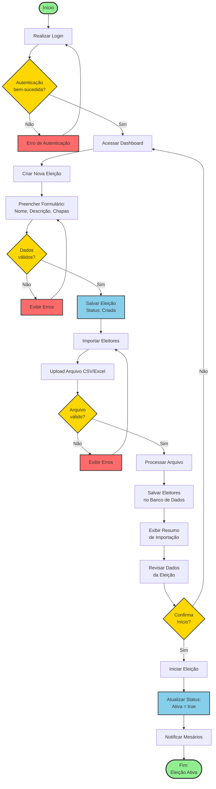

---

### Diagrama BPMN - Registro de Voto (Processo Completo com 3 Piscinas)

```mermaid
graph TB
    subgraph Pool1["🏊 Piscina: Mesário"]
        Start1([Início]) --> MesarioLoginTask[Login no Sistema]
        MesarioLoginTask --> SearchVoterTask[Buscar Eleitor<br/>por Matrícula]
        SearchVoterTask --> VoterFoundGateway{Eleitor<br/>encontrado?}
        
        VoterFoundGateway -->|Não| NotFoundError[Erro: Não Cadastrado]
        NotFoundError --> EndError1([Fim:<br/>Acesso Negado])
        
        VoterFoundGateway -->|Sim| CheckVotedGateway{Já<br/>votou?}
        CheckVotedGateway -->|Sim| AlreadyVotedError[Erro: Já Votou]
        AlreadyVotedError --> EndError1
        
        CheckVotedGateway -->|Não| AuthorizeTask[Autorizar Voto]
        AuthorizeTask --> GenerateCredentialTask[Gerar Credencial UUID]
        GenerateCredentialTask --> DisplayCredentialTask[Exibir Credencial]
        DisplayCredentialTask --> InformVoterTask[Informar Eleitor]
        InformVoterTask --> MessageFlow1[/Credencial\]
    end
    
    subgraph Pool2["🏊 Piscina: Eleitor na Urna"]
        MessageFlow1 --> Start2([Início:<br/>Na Urna])
        Start2 --> EnterCredentialTask[Inserir Credencial]
        EnterCredentialTask --> ValidateCredentialGateway{Credencial<br/>válida?}
        
        ValidateCredentialGateway -->|Não| InvalidCredError[Erro: Credencial Inválida]
        InvalidCredError --> RetryGateway{Tentar<br/>novamente?}
        RetryGateway -->|Sim| EnterCredentialTask
        RetryGateway -->|Não| EndError2([Fim:<br/>Sem Voto])
        
        ValidateCredentialGateway -->|Sim| LoadCandidatesTask[Carregar Candidatos]
        LoadCandidatesTask --> DisplayCandidatesTask[Exibir Candidatos]
        DisplayCandidatesTask --> SelectTask[Selecionar Opção]
        
        SelectTask --> VoteTypeGateway{Tipo de<br/>Voto?}
        VoteTypeGateway -->|Candidato| SelectCandidateTask[Selecionar Chapa]
        VoteTypeGateway -->|Branco| BlankVoteTask[Voto em Branco]
        VoteTypeGateway -->|Nulo| NullVoteTask[Voto Nulo]
        
        SelectCandidateTask --> ConfirmScreenTask[Tela de Confirmação]
        BlankVoteTask --> ConfirmScreenTask
        NullVoteTask --> ConfirmScreenTask
        
        ConfirmScreenTask --> ConfirmGateway{Confirma<br/>voto?}
        ConfirmGateway -->|Não| SelectTask
        ConfirmGateway -->|Sim| MessageFlow2[/Voto Confirmado\]
    end
    
    subgraph Pool3["🏊 Piscina: Sistema Backend"]
        MessageFlow2 --> TransactionStart[BEGIN TRANSACTION]
        TransactionStart --> RevalidateTask[Revalidar Credencial<br/>FOR UPDATE]
        RevalidateTask --> StillValidGateway{Ainda<br/>válida?}
        
        StillValidGateway -->|Não| RollbackTask[ROLLBACK]
        RollbackTask --> TransactionError[Erro: Race Condition]
        TransactionError --> EndError2
        
        StillValidGateway -->|Sim| InsertVoteTask[INSERT Voto<br/>⚠️ SEM eleitorId]
        InsertVoteTask --> InvalidateCredTask[UPDATE Credencial<br/>usada = true]
        InvalidateCredTask --> MarkVoterTask[UPDATE Eleitor<br/>jaVotou = true]
        MarkVoterTask --> CommitTask[COMMIT TRANSACTION]
        CommitTask --> SuccessMessage[Exibir Sucesso]
        SuccessMessage --> ClearScreenTask[Limpar Tela]
        ClearScreenTask --> EndSuccess([Fim:<br/>Voto Registrado])
    end
    
    style Start1 fill:#90ee90,stroke:#333,stroke-width:3px
    style Start2 fill:#90ee90,stroke:#333,stroke-width:3px
    style EndError1 fill:#ff6b6b,stroke:#333,stroke-width:3px
    style EndError2 fill:#ff6b6b,stroke:#333,stroke-width:3px
    style EndSuccess fill:#90ee90,stroke:#333,stroke-width:3px
    style VoterFoundGateway fill:#ffd700,stroke:#333,stroke-width:2px
    style CheckVotedGateway fill:#ffd700,stroke:#333,stroke-width:2px
    style ValidateCredentialGateway fill:#ffd700,stroke:#333,stroke-width:2px
    style VoteTypeGateway fill:#ffd700,stroke:#333,stroke-width:2px
    style ConfirmGateway fill:#ffd700,stroke:#333,stroke-width:2px
    style StillValidGateway fill:#ffd700,stroke:#333,stroke-width:2px
    style RetryGateway fill:#ffd700,stroke:#333,stroke-width:2px
    style TransactionStart fill:#87ceeb,stroke:#333,stroke-width:2px
    style InsertVoteTask fill:#ffb6c1,stroke:#333,stroke-width:3px
    style CommitTask fill:#87ceeb,stroke:#333,stroke-width:2px
    style MessageFlow1 fill:#dda0dd,stroke:#333,stroke-width:2px
    style MessageFlow2 fill:#dda0dd,stroke:#333,stroke-width:2px
```

---

### Diagrama BPMN - Apuração de Votos (Administrador)

```mermaid
graph TB
    Start([Início:<br/>Votação Ativa]) --> MonitorTask[Monitorar Votação]
    MonitorTask --> ViewProgressTask[Visualizar Progresso]
    ViewProgressTask --> DecideGateway{Encerrar<br/>eleição?}
    
    DecideGateway -->|Não| WaitTask[Aguardar Intervalo]
    WaitTask --> MonitorTask
    
    DecideGateway -->|Sim| ClickCloseTask[Clicar em<br/>Encerrar Eleição]
    ClickCloseTask --> ConfirmGateway{Confirma<br/>encerramento?}
    
    ConfirmGateway -->|Não| MonitorTask
    
    ConfirmGateway -->|Sim| LockSystemTask[Bloquear Sistema]
    LockSystemTask --> UpdateStatusTask[UPDATE Eleicao<br/>status = Encerrada]
    UpdateStatusTask --> WaitPendingTask[Aguardar Votos<br/>em Andamento]
    
    WaitPendingTask --> AccessResultsTask[Acessar Resultados]
    AccessResultsTask --> CheckStatusGateway{Status<br/>Encerrada?}
    
    CheckStatusGateway -->|Não| ErrorNotClosed[Erro: Não Encerrada]
    ErrorNotClosed --> EndError([Fim:<br/>Sem Resultados])
    
    CheckStatusGateway -->|Sim| StartCountingTask[Iniciar Apuração]
    
    subgraph SubProcess["📊 Subprocesso: Contagem de Votos"]
        StartCountingTask --> CountValidTask[Contar Votos Válidos<br/>GROUP BY chapaId]
        CountValidTask --> CountBlankTask[Contar Votos Brancos]
        CountBlankTask --> CountNullTask[Contar Votos Nulos]
        CountNullTask --> CalculateTask[Calcular Totais<br/>e Percentuais]
        CalculateTask --> SortTask[Ordenar Resultados]
        SortTask --> IdentifyWinnerTask[Identificar Vencedor]
    end
    
    IdentifyWinnerTask --> GenerateReportTask[Gerar Relatório Completo]
    GenerateReportTask --> DisplayResultsTask[Exibir Resultados<br/>Gráficos e Tabelas]
    
    DisplayResultsTask --> ExportGateway{Exportar<br/>resultados?}
    
    ExportGateway -->|Não| EndView([Fim:<br/>Resultados Visualizados])
    
    ExportGateway -->|Sim| FormatGateway{Escolher<br/>Formato}
    
    FormatGateway -->|PDF| GeneratePDFTask[Gerar PDF]
    FormatGateway -->|Excel| GenerateExcelTask[Gerar Excel]
    FormatGateway -->|JSON| GenerateJSONTask[Gerar JSON]
    
    GeneratePDFTask --> DownloadTask[Download Arquivo]
    GenerateExcelTask --> DownloadTask
    GenerateJSONTask --> DownloadTask
    
    DownloadTask --> AuditLogTask[Registrar em Log<br/>de Auditoria]
    AuditLogTask --> EndExport([Fim:<br/>Apuração Exportada])
    
    subgraph Annotation["📝 Anotação: Garantias de Anonimato"]
        Note1[A apuração NÃO acessa<br/>tabela Eleitor]
        Note2[Impossível vincular<br/>voto a eleitor]
        Note3[Apenas agregações anônimas]
    end
    
    CountValidTask -.-> Note1
    Note1 -.-> Note2
    Note2 -.-> Note3
    
    style Start fill:#90ee90,stroke:#333,stroke-width:3px
    style EndError fill:#ff6b6b,stroke:#333,stroke-width:3px
    style EndView fill:#90ee90,stroke:#333,stroke-width:3px
    style EndExport fill:#90ee90,stroke:#333,stroke-width:3px
    style DecideGateway fill:#ffd700,stroke:#333,stroke-width:2px
    style ConfirmGateway fill:#ffd700,stroke:#333,stroke-width:2px
    style CheckStatusGateway fill:#ffd700,stroke:#333,stroke-width:2px
    style ExportGateway fill:#ffd700,stroke:#333,stroke-width:2px
    style FormatGateway fill:#ffd700,stroke:#333,stroke-width:2px
    style LockSystemTask fill:#ffb6c1,stroke:#333,stroke-width:2px
    style UpdateStatusTask fill:#87ceeb,stroke:#333,stroke-width:2px
    style StartCountingTask fill:#87ceeb,stroke:#333,stroke-width:2px
    style Note1 fill:#fffacd,stroke:#333,stroke-width:1px
    style Note2 fill:#fffacd,stroke:#333,stroke-width:1px
    style Note3 fill:#fffacd,stroke:#333,stroke-width:1px
```

---

## Legenda dos Elementos BPMN

### Eventos
- **🟢 Círculo Verde (Início):** Evento de início do processo
- **🟢 Círculo Verde com borda grossa (Fim):** Evento de término bem-sucedido
- **🔴 Círculo Vermelho (Fim):** Evento de término com erro

### Atividades
- **🔵 Retângulo Azul:** Tarefa (Task) - Unidade de trabalho
- **🔵 Retângulo Azul com bordas arredondadas:** Subprocesso
- **📊 Subgraph:** Subprocesso expandido mostrando detalhes internos

### Gateways (Decisões)
- **🟡 Losango Amarelo:** Gateway Exclusivo (XOR) - Apenas um caminho é seguido
- **🟡 Losango com X:** Gateway de decisão explícita

### Pools e Lanes
- **🏊 Piscina (Pool):** Representa um participante ou organização
- **Raia (Lane):** Subdivide uma piscina por função ou papel

### Fluxos
- **Seta Sólida →:** Fluxo de sequência (ordem de execução)
- **Seta Tracejada ⇢:** Fluxo de mensagem entre participantes
- **Seta Pontilhada ··→:** Associação ou anotação

### Cores Utilizadas
- **🟩 Verde:** Eventos de início e término positivo
- **🟦 Azul Claro:** Tarefas de sistema/automáticas
- **🟨 Amarelo:** Gateways de decisão
- **🟥 Vermelho:** Erros e eventos de exceção
- **🟪 Rosa:** Tarefas críticas (ex: registro de voto anônimo)
- **🟫 Bege:** Anotações e documentação

---

## Descrição dos Principais Fluxos

### 1. **Autenticação Unificada**
- Único endpoint de login (`/api/auth/login`) para Admin e Mesário
- Sistema identifica o tipo de usuário automaticamente
- Gera JWT com role (`admin` ou `mesario`)
- Frontend armazena token e redireciona conforme role

### 2. **Gestão de Eleições (Admin)**
- Admin cria eleição com nome, descrição e chapas
- Admin importa lista de eleitores via CSV/Excel
- Admin inicia eleição (muda status para `Ativa`)
- Admin encerra eleição (muda status para `Encerrada`)
- Admin visualiza resultados apenas após encerramento

### 3. **Autorização de Eleitores (Mesário)**
- Mesário busca eleitor por matrícula
- Sistema verifica se eleitor está apto (não votou)
- Mesário autoriza voto
- Sistema gera credencial única (UUID)
- Credencial é exibida para o eleitor

### 4. **Votação Anônima (Urna)**
- **FASE 1: Validação**
  - Eleitor insere credencial na urna
  - Sistema valida credencial (não autenticada, anônima)
  - Sistema exibe candidatos da eleição
- **FASE 2: Votação**
  - Eleitor seleciona candidato e confirma
  - Sistema registra voto **SEM vincular à identidade**
  - Sistema invalida credencial (usada = true)
  - Sistema marca eleitor como "já votou"
  - **Transação atômica garante integridade**

### 5. **Resultados e Auditoria**
- Admin acessa resultados após encerramento
- Sistema agrega votos por chapa
- Não há vínculo entre voto e eleitor (anonimato)
- Logs de sistema registram eventos sem dados sensíveis

---

## Garantias de Segurança e Anonimato

### RN13 - Impossibilidade Técnica de Vincular Voto ao Eleitor

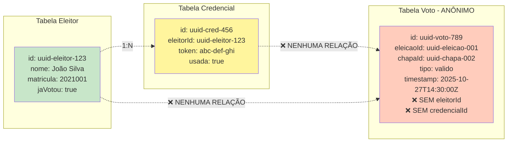

**Princípios de Anonimato:**
1. A tabela `Voto` **NÃO** possui campo `eleitorId` ou `credencialId`
2. A credencial é validada e **imediatamente descartada** antes do registro do voto
3. O timestamp do voto é genérico (não há relação temporal direta)
4. Logs do sistema **NÃO** registram "Eleitor X votou em Chapa Y"
5. Transação atômica garante que marcação de "jaVotou" e registro de voto são simultâneos, mas sem vínculo direto

---

## Tecnologias e Ferramentas

| Camada | Tecnologia | Versão | Propósito |
|--------|-----------|--------|-----------|
| **Frontend** | Vue.js | 3.x | Framework JavaScript reativo |
| | Vuetify | 3.x | Biblioteca de componentes Material Design |
| | Vue Router | 4.x | Gerenciamento de rotas SPA |
| | Pinia/Vuex | - | Gerenciamento de estado global |
| | Axios | 1.x | Cliente HTTP para API REST |
| | Vite | 5.x | Build tool e dev server |
| **Backend** | NestJS | 10.x | Framework Node.js com TypeScript |
| | Express | 4.x | Servidor HTTP (base do NestJS) |
| | TypeScript | 5.x | Superset JavaScript com tipagem |
| | Prisma | 5.x | ORM para PostgreSQL |
| | Passport JWT | 10.x | Autenticação com JSON Web Tokens |
| | bcrypt | 5.x | Hash de senhas |
| | class-validator | 0.14.x | Validação de DTOs |
| **Database** | PostgreSQL | 15 | Banco de dados relacional |
| **Deploy** | Docker | 24.x | Containerização |
| | Docker Compose | 2.x | Orquestração de containers |
| | Render.com | - | Platform as a Service (PaaS) |
| | NGINX | 1.25.x | Servidor web e proxy reverso |

---

## Conformidade com Requisitos Não-Funcionais

| Requisito | Implementação | Componentes Envolvidos |
|-----------|---------------|------------------------|
| **RNF01 - Segurança & Anonimato** | HTTPS/TLS, JWT, Modelo de dados anônimo | NGINX, Auth Module, Tabela Voto sem eleitorId |
| **RNF02 - Usabilidade** | Interface Vuetify Material Design, Fluxo simplificado | Vue.js, Vuetify, Router |
| **RNF04 - Integridade de Dados** | Transações ACID, Credenciais de uso único | Prisma Transactions, PostgreSQL |
| **RNF05 - Auditabilidade** | Logs de eventos, Timestamps | NestJS Logger, Tabela Voto (timestamp) |

---

## Padrões de Arquitetura Aplicados

1. **MVC (Model-View-Controller):**
   - **Model:** Prisma Schema, Repositories
   - **View:** Vue.js Components
   - **Controller:** NestJS Controllers

2. **Service Layer Pattern:**
   - Controllers delegam lógica de negócio para Services
   - Services orquestram operações e aplicam regras de negócio

3. **Repository Pattern:**
   - Repositories abstraem acesso ao banco de dados
   - Isolamento da lógica de persistência

4. **DTO (Data Transfer Object):**
   - Validação de payloads com class-validator
   - Separação entre modelos de domínio e API

5. **Guard Pattern (NestJS):**
   - JWT Guard para autenticação
   - Roles Guard para autorização baseada em papéis

6. **RESTful API:**
   - Endpoints seguem convenções REST
   - Verbos HTTP semânticos (GET, POST, PATCH, DELETE)

---

## Conclusão

Esta arquitetura foi projetada para garantir:
- ✅ **Segurança máxima** através de JWT, HTTPS e Guards
- ✅ **Anonimato absoluto** do voto através de modelo de dados desacoplado
- ✅ **Integridade transacional** com Prisma e PostgreSQL
- ✅ **Separação de responsabilidades** com MVC e Service Layer
- ✅ **Escalabilidade** através de containerização Docker
- ✅ **Manutenibilidade** com TypeScript, padrões e documentação

O sistema está pronto para ser apresentado como TCC, demonstrando competência técnica em desenvolvimento full-stack, segurança de aplicações web e arquitetura de sistemas críticos.
